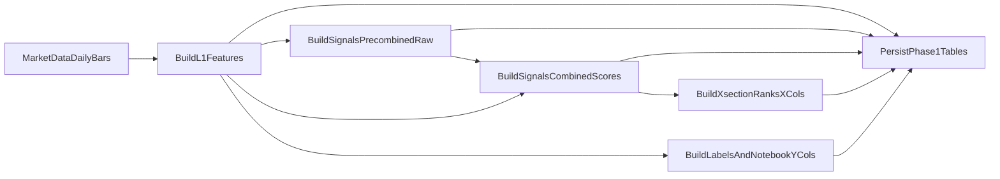

# Phase 1 Detailed Plan: Deterministic Features, Labels, and Persistence

## Goal

Build a production-grade daily pipeline that transforms market data into deterministic strategy datasets and persists them for downstream modeling and trading.

Phase 1 must deliver:

- `features_l1_daily`
- `signals_precombined_daily` (per-family **raw precombined series** produced *inside* each `get_*_score` **before** the family-level final reduction step (often `combine_features`) — the internal horizon stacks / intermediate columns that the score functions use; do **not** duplicate L1 or post-L1 “helper frame” fields here; L1 is finalized and not re-expanded via this table)
- `signals_combined_daily` (the **10** final `*_score` series after each family applies its final reduction step; `combine_features` is one implementation option, not a requirement — the inputs to cross-sectional ranking for `x_cols`)
- `signals_xsection_daily` (10 percentile ranks that materialize the notebook’s `x_cols` selection, ranked from `signals_combined_daily`)
- `labels_daily` (one row per day/symbol, **wide** supervised targets: forward returns and notebook `y_cols` **as suffixed columns** e.g. `_1`, `_5` — **no** `horizon` column; **not** stored in `signals_precombined_daily`)

No model training, inference, portfolio optimization, or order publishing in this phase.

---

## Scope and boundaries

In scope:

- Daily data extraction from `market_data` schema.
- Feature engineering ported from `strategies/research/double_sort.ipynb`.
- Label generation with strict no-lookahead rules.
- Idempotent writes into strategy tables.
- Backfill support for time ranges.

Out of scope:

- `model_runs`, `predictions_daily`, `target_weights_daily`, `order_intents_daily`.
- Which job runner invokes the 01:00 run (cron, Airflow, etc.); the **cadence and batch window** (including that bounds apply to `ohlcv.open_time`) are specified under *Pipeline schedule and lookback* in the Time alignment section.
- Risk/OMS integration.

---

## Target module layout

Create a self-contained package under `strategies/modules`:

```text
strategies/modules/double_sort_daily/
  __init__.py
  config.py
  data_loader.py
  features_l1.py
  signals_precombined.py
  signals_combined.py
  labels.py
  persistence.py
  pipeline.py
  signals_xsection.py
  validators.py
```

Test layout:

```text
strategies/tests/double_sort_daily/
  test_features_l1.py
  test_signals_precombined.py
  test_signals_combined.py
  test_signals_xsection.py
  test_labels.py
  test_persistence_idempotency.py
  test_pipeline_e2e_smoke.py
```

---

## Data schema design (Phase 1 tables)

Use Alembic to add strategy-owned tables. Use schema: `strategies_daily`.

### Time alignment rule

`bar_ts` is the **trading day key** stored as a UTC midnight timestamp: **`date + 00:00:00` in GMT/UTC** (PostgreSQL: `date AT TIME ZONE 'UTC'`, or `timestamptz` with offset `+00`).

- Store as PostgreSQL `timestamptz` (this should be the canonical **UTC** instant for `00:00:00`, not a “floating” local-midnight without a zone).
- This is the primary join key for cross-sectional operations: group by `bar_ts` across the universe, not by calendar date.

### Pipeline schedule and lookback

- **When:** all Phase 1 data processing runs **once per day at 01:00** (in the same timezone the pipeline config uses for the trading-day cut; if unspecified, use **UTC** to stay aligned with the stored `bar_ts` convention above).
- **What:** each run loads the **most recent 24 daily bars** per symbol — the 24 full bars in the **wall-clock** window **from yesterday 01:00 through today 00:00** (i.e. the 24 complete daily bars that are finished once the day closes at 00:00, with the job executing at 01:00 after that close). For rolling feature windows (e.g. 250-day VWAP), the implementation still orders by this daily series; the **batch** is always this 24-bar tail unless a backfill mode overrides the range.
- **Timestamp column for that window (explicit):** any **time-range filter, predicate, or “from … to …”** condition tied to the pipeline schedule (including the 01:00 / yesterday–today window above) is evaluated on **`market_data.ohlcv.open_time`** — the kline / bar open timestamp — not on a different column (e.g. not `close_time` alone). L1 `close = last(close)` and sorting after ingest still use the same `open_time` ordering described under daily L1 bars; persisted **`bar_ts`** remains the UTC-midnight day key, separate from the raw `open_time` filter.
- **Primary key in tables:** each row in that batch is still keyed by the normalized per-day `bar_ts` (UTC midnight for that bar’s day key), not by the 01:00 run timestamp.

**Daily L1 bars (per current `double_sort.ipynb` math, with a storage-time tweak for `bar_ts`):** the research pipeline is **not** one row per raw intraday OHLCV print. It first collapses intraday `market_data.ohlcv` to **one row per (UTC calendar `date`, `symbol`)**, with:

- `close = last(close)` for that day (after sorting intraday rows by `open_time`)
- `volume`, `quote_volume`, `taker_buy_base_volume` = **sum** over intraday rows for that day (the notebook also used to sum `taker_buy_quote_volume`, but the Phase 1 L1 table intentionally omits quote-taker in storage per product decision)

**VWAP (`vwap_250`) and the same L1 inputs:** The 250-day rolling VWAP is `quote_volume.rolling(250).sum() / volume.rolling(250).sum()` (per `symbol`, ordered by `bar_ts`, with the usual `min_periods` policy you choose) — i.e. sum of the last 250 `quote_volume` over sum of the last 250 `volume` — using **the same** per-day `quote_volume` and `volume` that come from that intraday **summation** (not a different OHLCV pass). The intended implementation is to compute it **from the L1 row only**: apply the rolling ratio to the **already-aggregated** `quote_volume` and `volume` (equivalent to re-deriving from raw only if you need a parity check). **Do not** build VWAP from `log_quote_volume` / `log_volume` or other transforms—use the level series. For any feature that relates price to VWAP (e.g. vwapreversion), use the **L1** `close` (last close from the same day bucket) together with L1 `vwap_250` so `close`, `quote_volume`, and `volume` stay consistent. Per day, `quote_volume / volume` is the session VWAP implied by those sums.

**Storage convention:** the notebook’s working frame often uses a `ts` that looks like the **last intraday `open_time`**, but the production tables intentionally **do not** store that timestamp as a column. The persisted key is the UTC-midnight `bar_ts` only.

The column contracts below are derived from the current research implementation in `strategies/research/double_sort.ipynb` (naming is normalized to SQL-safe snake_case; most field math maps 1:1, with the explicit exception that the persisted `bar_ts` is **normalized to UTC midnight** rather than the notebook’s end-of-day `ts`).

### Common metadata (all Phase 1 tables)

These columns are recommended on every Phase 1 table:

| Column | Type | Notes |
| --- | --- | --- |
| `created_at` | `timestamptz` not null | server default `now()` |
| `updated_at` | `timestamptz` not null | updated on upsert |
| `pipeline_version` | `text` not null | semantic version of code + config |
| `source` | `text` null | optional, e.g. `market_data.ohlcv` |

### 1) `features_l1_daily`

**Grain / primary key:** one row per `(bar_ts, symbol)`.

| Column | Type | Notes / definition (from notebook) |
| --- | --- | --- |
| `bar_ts` | `timestamptz` not null | **UTC day key:** trading date at `00:00:00+00:00` (this is the join key; it is the calendar day, not the last intraday timestamp) |
| `symbol` | `text` not null | instrument identifier |
| `close` | `double precision` not null | daily bar close: `last(close)` within the day after sorting by `open_time` |
| `volume` | `double precision` not null | daily bar base volume: `sum(volume)` within the day |
| `quote_volume` | `double precision` not null | daily bar quote volume: `sum(quote_volume)` within the day |
| `taker_buy_base_volume` | `double precision` not null | daily bar taker buy base: `sum(taker_buy_base_volume)` within the day |
| `log_close` | `double precision` not null | `log(close)` |
| `log_return` | `double precision` null | per-symbol `log_close.diff()` on the daily bar series (the first day per symbol is null by construction) |
| `ewvol_20` | `double precision` null | per-symbol EWM volatility: `ewm(span=20, adjust=False).std()` on `log_return` (this replaces notebook `log_vol`) |
| `norm_return` | `double precision` null | per day: `log_return / ewvol_20` (guard divide-by-zero on `ewvol_20`); same as notebook intermediate `x` before cumsum |
| `norm_close` | `double precision` null | per `symbol`, ordered by `bar_ts`: `norm_return.cumsum()` (matches notebook `cumsum(x)` after `x = log_return / ewvol_20`) |
| `log_volume` | `double precision` null | `log(volume)` (daily `volume` is a sum) |
| `log_quote_volume` | `double precision` null | `log(quote_volume)` (daily `quote_volume` is a sum) |
| `vwap_250` | `double precision` null | rolling 250 **daily** bars: `quote_volume.rolling(250).sum() / volume.rolling(250).sum()` **per `symbol`**, ordered by `bar_ts`, using the **L1** `quote_volume` and `volume` from the same summation as the rest of the row (see **VWAP (`vwap_250`) and the same L1 inputs** above; the notebook’s expression is written without a `groupby`, but production must not mix symbols in the rolling window) |

Recommended indexes (in addition to the primary key):

- `CREATE INDEX ... ON features_l1_daily (bar_ts);`
- `CREATE INDEX ... ON features_l1_daily (symbol, bar_ts);`

### 2) `signals_precombined_daily`

**Grain / primary key:** one row per `(bar_ts, symbol)`.

`signals_precombined_daily` stores the **per-family raw “variation” series** *inside* each `get_*_score` implementation **up to, but not including,** the family-level final reduction step (commonly `combine_features(...)`) that collapses internal horizons into the scalar `*_score` for that family.

Concretely: for each selected score family, materialize the **wide internal frame** the function builds (multi-horizon columns / pre-aggregation features), with **namespaced column names** so different families do not collide. **Persisted column names** are **`{family}_{n}`** — a family base (`mom`, `trend`, `breakout`, `vwaprev`, `takerratio`, `skew`, `vol`, **`vlm`**, **`quotevlm`**, **`retvlmcor`**, …) and a numeric suffix **`n`** (the only horizon you vary within that family; **three** values of `n` per family, **30** columns total). The notebook’s compound labels (e.g. `10m5`) map to a single `n` (e.g. `10` for the leading span); implement that mapping in `validators.py` if names differ. Notebook helpers `get_volume_score` / `get_quotevol_score` / `get_retvolcor_score` still feed **`vlm_*`**, **`quotevlm_*`**, and **`retvlmcor_*`** columns in persistence.

**What does *not* belong here (by design):**

- **No** `*_score` outputs (those live in `signals_combined_daily`).
- **No** duplication of `features_l1_daily` fields (for example, do not store `vwap_250` / `ewvol_20` / `log_return` here “for convenience”). Downstream code should **join** to `features_l1_daily` as needed. L1 is finalized; this table is **not** a backdoor to expand L1.
- **No** notebook `y_cols` / supervised targets (those live in `labels_daily`).

**Model path selection (per notebook `x_cols` lines 1-5 in `double_sort.ipynb`, user-selected):** only materialize the **families** needed to recompute the **10** `*_score` values that feed `x_cols` ranks:

- `get_mom_score`, `get_trend_score`, `get_breakout_score`, `get_vwaprev_score`, `get_takerratio_score`, `get_skew_score`, `get_vol_score`, `get_volume_score`, `get_quotevol_score`, `get_retvolcor_score`

Do **not** materialize other families for Phase 1 unless you have a non-model consumer (the research notebook may still define helpers like `get_drawdown_score`, but they are not in your `x_cols`).

**Note on repo drift:** the checked-in `double_sort.ipynb` may still show an older `x_cols` list; treat the **10-family** `x_cols` in this plan as the contract for the trading module.

#### 2.1) Optional debugging / QA columns

| Column | Type | Notes |
| --- | --- | --- |
| `n_nonfinite` | `int` | count of non-finite values in the precombined feature bundle (after computing, before any optional trimming) |

#### 2.2) Precombined column schema (per `get_*_score`, before family-level final reduction)

For each family, materialize **three** `double precision` columns `family_n` (see **`n` values** column), one **general formula** in terms of `n` (and helpers like `d` where noted). All series: **per `symbol`**, ordered by `bar_ts`. `log_return`, `log_volume`, `log_quote_volume` are from L1; **`vwap` in these formulas** is L1 **`vwap_250`**. Warmup / null edges follow the underlying windows. Match `strategies/research/double_sort.ipynb` where the intent is the same; breakout here uses `n ∈ {10, 20, 40}` (not 20/40/80 from the notebook).

**Naming in Postgres:** columns are **`{family}_{n}`** (e.g. `mom_10`, `vlm_10`, `quotevlm_20`, `retvlmcor_40`). Optional table-wide prefix in `validators.py` (e.g. `pre_mom_10`, `pre_vlm_10`).

| Family (feeds `*_score` in `signals_combined_daily`) | `n` values (suffix) | General formula (pandas-style; integer spans) |
| --- | --- | --- |
| Momentum | 10, 20, 40 | `mom_n = (log_return.ewm(span=n).sum() - log_return.ewm(span=n // 2).sum()) / (n - n // 2)` — use `ewm(..., adjust=False)` if matching the notebook. |
| Trend | 5, 10, 20 | `d = close.diff().ewm(span=20).std()` (guard divide-by-zero). `trend_n = (close.ewm(span=n).mean() - close.ewm(span=4 * n).mean()) / d` |
| Breakout | 10, 20, 40 | `roll_max = close.rolling(n).max()`, `roll_min = close.rolling(n).min()`; `breakout_n = ((close - (roll_max - roll_min) / 2) / (roll_max - roll_min)).ewm(span=5).mean()` (rolling `n` **daily** bars) |
| VWAP reversion | 5, 10, 20 | `d = close.diff().ewm(span=20).std()` (guarded). `vwaprev_n = (close - vwap.ewm(span=n).mean()) / d` |
| Taker ratio | 10, 20, 40 | `takerratio_n = (taker_buy_base_volume / volume).ewm(span=n).mean()` |
| Return skew | 10, 20, 40 | `skew_n = log_return.rolling(n).skew()` |
| Volatility level | 10, 20, 40 | `vol_n = log_return.ewm(span=n).std()` |
| Volume level | 10, 20, 40 | `vlm_n = log_volume.ewm(span=n).mean()` |
| Quote volume level | 10, 20, 40 | `quotevlm_n = log_quote_volume.ewm(span=n).mean()` |
| Return–volume correlation | 10, 20, 40 | `retvlmcor_n = log_return.rolling(n).corr(log_volume)` |

**Column count:** 10 families × 3 series = **30** precombined numeric columns, plus `bar_ts` / `symbol` / common metadata / optional `n_nonfinite`.

**Not in scope for the 10-feature model** (notebook defines them, do not materialize in Phase 1 unless you add them to the model path): e.g. `get_drawdown_score`, `get_ddath_score`, `get_maxret_score`, `get_logprc_score`, `get_takervol_score`, etc.

### 3) `signals_combined_daily` (the scalar `*_score` layer; input to `x_cols` ranks)

**Grain / primary key:** one row per `(bar_ts, symbol)`.

`signals_combined_daily` stores the **10** scalar `*_score` values produced *after* each `get_*_score` runs its final reduction step. `combine_features(...)` is one valid implementation pattern, but this table is not coupled to that specific function, so model-specific reductions are also valid if they produce the same per-`(bar_ts, symbol)` scalar `*_score` contract. These are the values cross-sectionally ranked into `signals_xsection_daily`.

Required `*_score` columns (10):

- `mom_score`, `trend_score`, `breakout_score`, `vwaprev_score`, `takerratio_score`, `skew_score`, `vol_score`, `vlm_score`, `quotevlm_score`, `retvlmcor_score`

#### 3.1) Optional debugging / QA columns

| Column | Type | Notes |
| --- | --- | --- |
| `n_nonfinite` | `int` | count of non-finite values across the 10 `*_score` fields (after computing, before persistence) |

### 4) `signals_xsection_daily` (the model feature vector in rank space)

**Grain / primary key:** one row per `(bar_ts, symbol)`.

`signals_xsection_daily` materializes the notebook’s `x_cols` (lines 1-5) from the selected `*_score` fields in **`signals_combined_daily`**. **Percentile ranking is the default implementation for Phase 1 parity with the notebook, not a hard requirement**; other cross-sectional transforms are valid if they preserve the same per-`(bar_ts, symbol)` feature contract for `x_cols`.

- ranks: `df.groupby([bar_ts]).rank(pct=True)` (same as the notebook; in SQL/Python, `bar_ts` is the day key and replaces notebook `ts`)

| Column | Type | Notebook grouping for cross-sectional rank | Notes |
| --- | --- | --- | --- |
| `mom_rank` | `double precision` null | `groupby(bar_ts)` | `rank(pct=True)` of `mom_score` |
| `trend_rank` | `double precision` null | `groupby(bar_ts)` | `trend_score` |
| `breakout_rank` | `double precision` null | `groupby(bar_ts)` | `breakout_score` |
| `vwaprev_rank` | `double precision` null | `groupby(bar_ts)` | `vwaprev_score` |
| `takerratio_rank` | `double precision` null | `groupby(bar_ts)` | `takerratio_score` |
| `skew_rank` | `double precision` null | `groupby(bar_ts)` | `skew_score` |
| `vol_rank` | `double precision` null | `groupby(bar_ts)` | `vol_score` |
| `vlm_rank` | `double precision` null | `groupby(bar_ts)` | `vlm_score` |
| `quotevlm_rank` | `double precision` null | `groupby(bar_ts)` | `quotevlm_score` |
| `retvlmcor_rank` | `double precision` null | `groupby(bar_ts)` | `retvlmcor_score` |
| `n_symbols_xs` | `int` null | n/a | optional: `count(*)` within `bar_ts` for diagnostics |

#### 4.1) Optional: research-only regime bins (not in `x_cols`)

The notebook also constructs `mom_bin` / `vol_bin` / `volume_bin` for analysis / sorting experiments. If you want parity with those notebook sections, store them in a separate table or as nullable columns, but do **not** treat them as part of the 10-feature model unless you explicitly add them to `x_cols`.

> Why split tables: `signals_precombined_daily` is the optional deep audit layer (raw per-family state before score reduction). `signals_combined_daily` is the compact on-symbol score layer. `signals_xsection_daily` is the cross-sectional `x_cols` contract (rank space).

### 5) `labels_daily`

**Grain / primary key:** one row per `(bar_ts, symbol)`.

**Design:** do **not** use a `horizon` column or multiple rows per symbol-day. Use **suffix columns** for each return step \(h\) (integer bar count on the daily grid). Example suffix `h=1` → column names end in `_1`.

Which suffixes to materialize (for example `1`, `5`, `10`) is **config** in `config.py` (same set drives `logret_fwd_*` / `simpret_fwd_*` and any supervised fields that depend on the forward return at that step).

#### 5.1) Forward returns (per configured suffix `h`)

For each configured `h`, persist:

| Column pattern | Type | Notes |
| --- | --- | --- |
| `logret_fwd_<h>` | `double precision` null | computed from raw L1 `close` as `log(close).diff(h).shift(-h)` (forward-looking by `h` bars, aligned at `bar_ts`) |
| `simpret_fwd_<h>` | `double precision` null | computed from raw L1 `close` as `close.pct_change(h).shift(-h)` (forward simple return, aligned at `bar_ts`) |

#### 5.2) Supervised learning targets (matches current notebook `y_cols`, suffixed to match §5.1)

In `double_sort.ipynb` lines 1-5, the supervised frame is `['ts','symbol','vol_weight','fwd_return','vol_weighted_return']`. For Phase 1, persist only the required output columns in wide form (notebook is 1-bar forward; replace `ts` with `bar_ts`):

| Column | Type | Notes |
| --- | --- | --- |
| `normret_fwd_<h>` | `double precision` null | computed from raw L1 `close` as `log(close).diff(h).shift(-h) / ewvol_20` (equivalently `logret_fwd_<h> / ewvol_20`); denominator volatility field is configurable later (for example a different `ewvol_*`). |

If you add targets for other steps \(h>1\), add parallel columns for the persisted supervised outputs (for example `normret_fwd_<h> = log(close).diff(h).shift(-h) / <configured_vol_field>`) only when the notebook’s **definitions** for those steps are agreed (default Phase 1: persist **`_1` supervised columns** and forward-return columns for any extra `h` you configure).

For Phase 1, treat **`labels_daily` as the canonical place** to reproduce the notebook’s `y_cols` in wide form. **Do not** put `y_cols` in `signals_precombined_daily`.

#### 5.3) Provenance (recommended)

| Column | Type | Notes |
| --- | --- | --- |
| `label_asof_ts` | `timestamptz` not null | should equal `bar_ts` (this is a logical as-of key for the daily row; the pipeline is responsible for not leaking future information when constructing features/labels) |
| `bar_ts_venue` | `text` null | optional human-readable string for the bar time in display timezone (not used for joins) |

Retention recommendation:

- Keep `features_l1_daily`, `signals_combined_daily`, and `signals_xsection_daily` long-term (these are the minimal training/inference “wide path” for the 10-rank `x_cols` model).
- Keep `signals_precombined_daily` long-term if you want the deepest audit trail of pre-score internals; otherwise it can be a shorter retention tier.
- Keep `labels_daily` long-term: it stores **wide** suffixed return and supervised columns (add columns when you add configured steps `h` — migrate schema or use a JSON column only if you intentionally defer; Phase 1 assumes fixed known suffixes in code + migration).

---

## Pipeline behavior



Execution semantics:

- **Production default:** one scheduled run per calendar day at **01:00**, processing the **24-bar** lookback (yesterday 01:00 → today 00:00) described under *Pipeline schedule and lookback*. Otherwise: run per `bar_ts` batch or bounded backfill over a time range.
- Deterministic transforms only; no random components.
- Idempotent persistence via upsert keyed on table PKs.
- Fail-fast if data coverage is below configured threshold.
- `BuildSignalsCombinedScores` should not depend on reading back `signals_precombined_daily` (scores are a function of `features_l1_daily` + the same `get_*_score` codepaths); `signals_precombined_daily` exists to persist intermediate bundles for audit/debug, not to be the computational prerequisite for `*_score` outputs.

---

## Detailed task breakdown

- [ ] **Task 1: Define config and contracts**
  - Create `config.py` constants for **label return suffixes** (e.g. `1, 5, 10`), the **24-bar** production lookback and **01:00** run assumption (aligned with *Pipeline schedule and lookback*), minimum symbol coverage, and clipping/ranking defaults.
  - Define column contracts for each output table in one place (`validators.py` or `persistence.py`).

- [ ] **Task 2: Implement market data loader**
  - Add `data_loader.py` to read intraday `market_data.ohlcv` and **build the daily L1 bar** using the same aggregations as the notebook: per **UTC** `(date, symbol)` bucket, `close=last` after sorting, volumes/taker base `sum` (use `max(open_time)` only as an implementation detail to pick `last`, not as a stored column). For the production time window, **filter and partition by `ohlcv.open_time`** as in *Pipeline schedule and lookback* (not `close_time` for the schedule bounds).
  - Set `bar_ts` to **UTC midnight** for that bucket (`<date> 00:00:00+00:00`). All downstream daily tables use this normalized `bar_ts` as the join key.

- [ ] **Task 3: Implement L1 feature builder**
  - Port notebook return/volatility and first-level financial variables into `features_l1.py`.
  - Compute `vwap_250` from L1 `quote_volume` and `volume` (same row / same intraday summation; see *VWAP (`vwap_250`) and the same L1 inputs* under Data schema design); wire vwapreversion to L1 `close` + L1 `vwap_250`.
  - Add deterministic null handling and per-symbol warmup trimming logic.

- [ ] **Task 4: Implement `signals_precombined_daily` (raw per-family pre-final-reduction bundles)**
  - Port the **10** `get_*_score` families listed in section 2 into `signals_precombined.py`, persisting the **internal multi-column bundles** *before* the family-level final reduction (often `combine_features`; no scalar `*_score` columns in this table), with persisted column names **`{family}_{n}`** and the **general formula per family** in *Precombined column schema* (section 2.2) (rename in `validators.py` if the notebook’s intermediate names are not already `family_n`).
  - Do **not** re-materialize L1 fields here; read joins to `features_l1_daily` when a score function needs inputs like `vwap_250`.

- [ ] **Task 5: Implement `signals_combined_daily` (final `*_score` before cross-sectional ranking)**
  - Implement `signals_combined.py` to produce the **10** scalar `*_score` values (section 3), using the same `get_*_score` definitions as the notebook and deterministically reading inputs from `features_l1_daily` (and any internal temporaries not persisted).

- [ ] **Task 6: Implement `signals_xsection_daily` (`x_cols` from notebook lines 1-5)**
  - Add cross-sectional feature assembly in `signals_xsection.py` to reproduce the **10** `x_cols` features using **only** the selected `*_score` fields from `signals_combined_daily`.
  - For Phase 1 parity, use notebook-style percentile ranking (`groupby(bar_ts)` + `rank(pct=True)`), but keep the implementation boundary explicit so alternative cross-sectional transforms can be swapped in later.
  - Enforce per-`bar_ts` invariants for the chosen transform (for ranking, ranks in `[0,1]` where applicable) and no NaN when scores are valid.

- [ ] **Task 7: Implement `labels_daily` (returns + notebook `y_cols`)**
  - Build a **wide** label frame in `labels.py`: one row per `(bar_ts, symbol)` with `logret_fwd_<h>` / optional `simpret_fwd_<h>` for each configured suffix `h`.
  - Persist notebook `y_cols` as **`_1` suffixed** columns in section 5.2; strict no-lookahead rules.

- [ ] **Task 8: Implement persistence layer**
  - Add `persistence.py` with table writers and upsert behavior.
  - Ensure each write records `pipeline_version` and timestamps.

- [ ] **Task 9: Implement phase entrypoint**
  - Add `pipeline.py` orchestrating extract -> transform -> validate -> persist.
  - Support run modes: **default production window** (24 bars, after the 00:00 close, as run at 01:00), single-`bar_ts` run, and time-range backfill.

- [ ] **Task 10: Add migration and indexes**
  - Add Alembic migration creating all Phase 1 tables and key indexes.
  - Add indexes for `bar_ts` range scans, `(bar_ts, symbol)` joins, and symbol lookups.

- [ ] **Task 11: Add tests and acceptance checks**
  - Implement unit and integration tests listed below.
  - Add a smoke run command for local validation on a small time window.

---

## Test plan for Phase 1

Unit tests:

- Feature determinism: same input DataFrame yields identical outputs.
- `vwap_250` on L1 matches `quote_volume.rolling(250).sum() / volume.rolling(250).sum()` on the **same** daily `quote_volume` and `volume` columns (not from `log_*` or a second raw read).
- Shape invariants: `signals_precombined_daily` contains **no** L1 re-duplication columns and **no** scalar `*_score` fields; `signals_combined_daily` includes **10** `*_score` columns (section 3); `signals_xsection_daily` includes **10** `*_rank` columns matching the `x_cols` list in `double_sort.ipynb` lines 1-5; `labels_daily` can reproduce the notebook `y_cols` for supervised learning (section 5.2).
- Cross-sectional invariants: normalization/rank constraints per `bar_ts`.
- Label integrity: each `logret_fwd_<h>` uses the correct forward shift; nulls at series ends and warmup are correct.
- Leakage guard: labels never use the same bar or past-only mishandled offsets.

Persistence tests:

- Upsert idempotency: running the same `bar_ts` batch twice does not duplicate rows.
- Schema contract: required columns exist with expected dtypes.

Integration tests:

- E2E smoke over a small historical window (for example 30-60 days).
- With the **24-bar** / **01:00** default, validate that a production-mode run only touches the expected `bar_ts` range (ends at the day that closed at 00:00 before the run) and that the **extract** is bounded with predicates on **`ohlcv.open_time`**, not `close_time`, per *Pipeline schedule and lookback*.
- Validate non-empty outputs and minimum symbol coverage.
- Validate joins across `features_l1_daily`, `signals_combined_daily`, and `signals_xsection_daily` by `(bar_ts, symbol)` without orphan rows.
- If `signals_precombined_daily` is enabled, validate it joins 1:1 to `(bar_ts, symbol)` and that its internal bundles can reproduce `signals_combined_daily` (spot-check a small window, if you add a consistency check).

---

## Acceptance criteria

- All Phase 1 tables exist and are populated for a target historical window (`features_l1_daily`, `signals_precombined_daily`, `signals_combined_daily`, `signals_xsection_daily`, and `labels_daily`).
- Re-running the pipeline for the same window produces identical results and row counts.
- Unit and integration tests pass in CI/local.
- A sample audit query can explain one `(symbol, bar_ts)` from `features_l1_daily` to `signals_combined_daily` to `signals_xsection_daily` to `labels_daily` (and optionally through `signals_precombined_daily` for internal pre-score columns).
- No lookahead leakage detected by tests.

---

## Risks and mitigations

- Drift from notebook logic during refactor:
  - Mitigation: snapshot notebook outputs for a fixed window and compare during migration.
- Cross-sectional bugs caused by missing symbols:
  - Mitigation: enforce minimum cross-section coverage and explicit fail/warn thresholds.
- Slow backfills:
  - Mitigation: batch by time range and upsert in chunks with indexes.

---

## Handoff to Phase 2

Phase 2 consumes `signals_xsection_daily` for `X`, `labels_daily` for `y` (including the notebook’s `y_cols` mapped to **wide** `*_1` columns in section 5.2, unless you change the target definition), and optionally `signals_precombined_daily` for debugging/explainability of the internal per-family pre-score state. `signals_combined_daily` remains the canonical place to fetch scalar `*_score` values for monitoring and for recomputing ranks offline.
