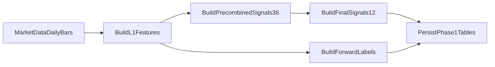

# Phase 1 Detailed Plan: Deterministic Features, Labels, and Persistence

## Goal

Build a production-grade daily pipeline that transforms market data into deterministic strategy datasets and persists them for downstream modeling and trading.

Phase 1 must deliver:

- `features_l1_daily`
- `signals_precombined_daily`
- `signals_final_daily`
- `labels_daily`

No model training, inference, portfolio optimization, or order publishing in this phase.

---

## Scope and boundaries

In scope:

- Daily data extraction from `market_data` schema.
- Feature engineering ported from `strategies/research/double_sort.ipynb`.
- Label generation with strict no-lookahead rules.
- Idempotent writes into strategy tables.
- Backfill support for date ranges.

Out of scope:

- `model_runs`, `predictions_daily`, `target_weights_daily`, `order_intents_daily`.
- Retraining cadence and scheduler orchestration details beyond a callable phase entrypoint.
- Risk/OMS integration.

---

## Target module layout

Create a self-contained package under `strategies/modules`:

```text
strategies/modules/double_sort_daily/
  __init__.py
  config.py
  data_loader.py
  features_l1.py
  signals_precombined.py
  signals_final.py
  labels.py
  persistence.py
  pipeline.py
  validators.py
```

Test layout:

```text
strategies/tests/double_sort_daily/
  test_features_l1.py
  test_signals_precombined.py
  test_signals_final.py
  test_labels.py
  test_persistence_idempotency.py
  test_pipeline_e2e_smoke.py
```

---

## Data schema design (Phase 1 tables)

Use Alembic to add strategy-owned tables. Recommended schema: `strategies`.

### 1) `features_l1_daily`

Primary key: `(trade_date, symbol)`

Core columns:

- `trade_date` (date), `symbol` (text)
- raw return/volatility primitives used repeatedly
- liquidity/risk helper fields needed by downstream signal transforms
- `created_at`, `updated_at`, `pipeline_version`

### 2) `signals_precombined_daily`

Primary key: `(trade_date, symbol)`

Columns:

- 36 signal columns (12 signal families x 3 variants)
- optional quality flags (null-rate or clipping flags)
- `created_at`, `updated_at`, `pipeline_version`

### 3) `signals_final_daily`

Primary key: `(trade_date, symbol)`

Columns:

- 12 finalized cross-sectional normalized factors
- rank/z-score fields if required by downstream model contract
- `created_at`, `updated_at`, `pipeline_version`

### 4) `labels_daily`

Primary key: `(trade_date, symbol, horizon)`

Columns:

- `horizon` (for example: `1d`, `5d`, `10d`)
- forward-return target and optional vol-adjusted target
- strict as-of metadata (`label_asof_date`) to prove no leakage
- `created_at`, `updated_at`, `pipeline_version`

Retention recommendation:

- Keep `features_l1_daily` and `signals_final_daily` long-term.
- Keep `signals_precombined_daily` with shorter retention if storage pressure appears.
- Keep `labels_daily` long-term for reproducible model research.

---

## Pipeline behavior



Execution semantics:

- Run per `trade_date` partition (or bounded backfill window).
- Deterministic transforms only; no random components.
- Idempotent persistence via upsert keyed on table PKs.
- Fail-fast if data coverage is below configured threshold.

---

## Detailed task breakdown

- [ ] **Task 1: Define config and contracts**
  - Create `config.py` constants for horizons, minimum symbol coverage, and clipping/ranking defaults.
  - Define column contracts for each output table in one place (`validators.py` or `persistence.py`).

- [ ] **Task 2: Implement market data loader**
  - Add `data_loader.py` to fetch required daily bars from `market_data` with explicit date filters.
  - Normalize timestamps to strategy trade date and enforce symbol ordering.

- [ ] **Task 3: Implement L1 feature builder**
  - Port notebook return/volatility and first-level financial variables into `features_l1.py`.
  - Add deterministic null handling and per-symbol warmup trimming logic.

- [ ] **Task 4: Implement precombined signals (36)**
  - Port 12 signal families and their 3 variants each to `signals_precombined.py`.
  - Add invariant checks (expected column count, finite ratio thresholds).

- [ ] **Task 5: Implement final signals (12)**
  - Add cross-sectional normalization and final factor assembly in `signals_final.py`.
  - Enforce per-date normalization invariants and clipping rules.

- [ ] **Task 6: Implement labels**
  - Build forward return labels in `labels.py` for configured horizons.
  - Add explicit anti-leakage checks (label uses only future prices relative to `trade_date`).

- [ ] **Task 7: Implement persistence layer**
  - Add `persistence.py` with table writers and upsert behavior.
  - Ensure each write records `pipeline_version` and timestamps.

- [ ] **Task 8: Implement phase entrypoint**
  - Add `pipeline.py` orchestrating extract -> transform -> validate -> persist.
  - Support run modes: single-date run and date-range backfill.

- [ ] **Task 9: Add migration and indexes**
  - Add Alembic migration creating all Phase 1 tables and key indexes.
  - Add indexes for `trade_date` scans and symbol lookups.

- [ ] **Task 10: Add tests and acceptance checks**
  - Implement unit and integration tests listed below.
  - Add a smoke run command for local validation on a small date window.

---

## Test plan for Phase 1

Unit tests:

- Feature determinism: same input DataFrame yields identical outputs.
- Shape invariants: expected number of columns for precombined and final signals.
- Cross-sectional invariants: normalization/rank constraints per date.
- Label integrity: horizon shifts and null edges are correct.
- Leakage guard: labels never use same-day or past-only mishandled offsets.

Persistence tests:

- Upsert idempotency: running same date twice does not duplicate rows.
- Schema contract: required columns exist with expected dtypes.

Integration tests:

- E2E smoke over a small historical window (for example 30-60 days).
- Validate non-empty outputs and minimum symbol coverage.
- Validate joins across tables by `(trade_date, symbol)` without orphan rows.

---

## Acceptance criteria

- All four Phase 1 tables exist and are populated for a target historical window.
- Re-running the pipeline for the same window produces identical results and row counts.
- Unit and integration tests pass in CI/local.
- A sample audit query can explain one symbol/day from L1 features to final signals to labels.
- No lookahead leakage detected by tests.

---

## Risks and mitigations

- Drift from notebook logic during refactor:
  - Mitigation: snapshot notebook outputs for a fixed window and compare during migration.
- Cross-sectional bugs caused by missing symbols:
  - Mitigation: enforce minimum cross-section coverage and explicit fail/warn thresholds.
- Slow backfills:
  - Mitigation: batch by date range and upsert in chunks with indexes.

---

## Handoff to Phase 2

Phase 2 consumes `signals_final_daily` and `labels_daily` to implement training/inference and `model_runs` metadata while keeping Phase 1 tables as the canonical feature store.
