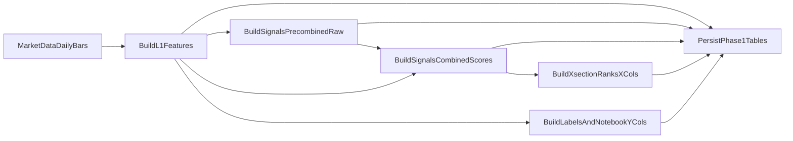

# Phase 1 Detailed Plan: Deterministic Features, Labels, and Persistence

## Goal

Build a production-grade daily pipeline that transforms market data into deterministic strategy datasets and persists them for downstream modeling and trading.

Phase 1 must deliver:

- `features_l1_daily`
- `signals_precombined_daily` (per-family **raw precombined series** produced *inside* each `get_*_score` **before** `combine_features` — the internal horizon stacks / intermediate columns that the score functions use; do **not** duplicate L1 or post-L1 “helper frame” fields here; L1 is finalized and not re-expanded via this table)
- `signals_combined_daily` (the **11** final `*_score` series after each `get_*_score` applies `combine_features` — the inputs to cross-sectional ranking for `x_cols`)
- `signals_xsection_daily` (11 percentile ranks that materialize the notebook’s `x_cols` selection, ranked from `signals_combined_daily`)
- `labels_daily` (one row per day/symbol, **wide** supervised targets: forward returns and notebook `y_cols` **as suffixed columns** e.g. `_1`, `_5` — **no** `horizon` column; **not** stored in `signals_precombined_daily`)

No model training, inference, portfolio optimization, or order publishing in this phase.

---

## Scope and boundaries

In scope:

- Daily data extraction from `market_data` schema.
- Feature engineering ported from `strategies/research/double_sort.ipynb`.
- Label generation with strict no-lookahead rules.
- Idempotent writes into strategy tables.
- Backfill support for time ranges.

Out of scope:

- `model_runs`, `predictions_daily`, `target_weights_daily`, `order_intents_daily`.
- Retraining cadence and scheduler orchestration details beyond a callable phase entrypoint.
- Risk/OMS integration.

---

## Target module layout

Create a self-contained package under `strategies/modules`:

```text
strategies/modules/double_sort_daily/
  __init__.py
  config.py
  data_loader.py
  features_l1.py
  signals_precombined.py
  signals_combined.py
  labels.py
  persistence.py
  pipeline.py
  signals_xsection.py
  validators.py
```

Test layout:

```text
strategies/tests/double_sort_daily/
  test_features_l1.py
  test_signals_precombined.py
  test_signals_combined.py
  test_signals_xsection.py
  test_labels.py
  test_persistence_idempotency.py
  test_pipeline_e2e_smoke.py
```

---

## Data schema design (Phase 1 tables)

Use Alembic to add strategy-owned tables. Use schema: `strategies_daily`.

### Time alignment rule

`bar_ts` is the **trading day key** stored as a UTC midnight timestamp: **`date + 00:00:00` in GMT/UTC** (PostgreSQL: `date AT TIME ZONE 'UTC'`, or `timestamptz` with offset `+00`).

- Store as PostgreSQL `timestamptz` (this should be the canonical **UTC** instant for `00:00:00`, not a “floating” local-midnight without a zone).
- This is the primary join key for cross-sectional operations: group by `bar_ts` across the universe, not by calendar date.

**Daily L1 bars (per current `double_sort.ipynb` math, with a storage-time tweak for `bar_ts`):** the research pipeline is **not** one row per raw intraday OHLCV print. It first collapses intraday `market_data.ohlcv` to **one row per (UTC calendar `date`, `symbol`)**, with:

- `close = last(close)` for that day (after sorting intraday rows by `open_time`)
- `volume`, `quote_volume`, `taker_buy_base_volume` = **sum** over intraday rows for that day (the notebook also used to sum `taker_buy_quote_volume`, but the Phase 1 L1 table intentionally omits quote-taker in storage per product decision)

**Storage convention:** the notebook’s working frame often uses a `ts` that looks like the **last intraday `open_time`**, but the production tables intentionally **do not** store that timestamp as a column. The persisted key is the UTC-midnight `bar_ts` only.

The column contracts below are derived from the current research implementation in `strategies/research/double_sort.ipynb` (naming is normalized to SQL-safe snake_case; most field math maps 1:1, with the explicit exception that the persisted `bar_ts` is **normalized to UTC midnight** rather than the notebook’s end-of-day `ts`).

### Common metadata (all Phase 1 tables)

These columns are recommended on every Phase 1 table:

| Column | Type | Notes |
| --- | --- | --- |
| `created_at` | `timestamptz` not null | server default `now()` |
| `updated_at` | `timestamptz` not null | updated on upsert |
| `pipeline_version` | `text` not null | semantic version of code + config |
| `source` | `text` null | optional, e.g. `market_data.ohlcv` |

### 1) `features_l1_daily`

**Grain / primary key:** one row per `(bar_ts, symbol)`.

| Column | Type | Notes / definition (from notebook) |
| --- | --- | --- |
| `bar_ts` | `timestamptz` not null | **UTC day key:** trading date at `00:00:00+00:00` (this is the join key; it is the calendar day, not the last intraday timestamp) |
| `symbol` | `text` not null | instrument identifier |
| `close` | `double precision` not null | daily bar close: `last(close)` within the day after sorting by `open_time` |
| `volume` | `double precision` not null | daily bar base volume: `sum(volume)` within the day |
| `quote_volume` | `double precision` not null | daily bar quote volume: `sum(quote_volume)` within the day |
| `taker_buy_base_volume` | `double precision` not null | daily bar taker buy base: `sum(taker_buy_base_volume)` within the day |
| `log_close` | `double precision` not null | `log(close)` |
| `log_return` | `double precision` null | per-symbol `log_close.diff()` on the daily bar series (the first day per symbol is null by construction) |
| `ewvol_20` | `double precision` null | per-symbol EWM volatility: `ewm(span=20, adjust=False).std()` on `log_return` (this replaces notebook `log_vol`) |
| `norm_close` | `double precision` null | notebook: `x = log_return / ewvol_20` then `groupby(symbol) cumsum(x)` (guard divide-by-zero on `ewvol_20`) |
| `log_volume` | `double precision` null | `log(volume)` (daily `volume` is a sum) |
| `log_quote_volume` | `double precision` null | `log(quote_volume)` (daily `quote_volume` is a sum) |
| `vwap_250` | `double precision` null | rolling 250 **daily** bars: \(\sum_{250} quote\_volume / \sum_{250} volume\) with rolling windows **per `symbol`**, ordered by `bar_ts` (the notebook’s expression is written without a `groupby`, but production must not mix symbols in the rolling window) |

Recommended indexes (in addition to the primary key):

- `CREATE INDEX ... ON features_l1_daily (bar_ts);`
- `CREATE INDEX ... ON features_l1_daily (symbol, bar_ts);`

### 2) `signals_precombined_daily`

**Grain / primary key:** one row per `(bar_ts, symbol)`.

`signals_precombined_daily` stores the **per-family raw “variation” series** *inside* each `get_*_score` implementation **up to, but not including,** the final `combine_features(...)` call that collapses internal horizons into the scalar `*_score` for that family.

Concretely: for each selected score family, materialize the **wide internal frame** the function builds (multi-horizon columns / pre-aggregation features), with **namespaced column names** so different families do not collide (mirror the notebook’s internal naming where stable; otherwise define an explicit rename map in `validators.py`).

**What does *not* belong here (by design):**

- **No** `*_score` outputs (those live in `signals_combined_daily`).
- **No** duplication of `features_l1_daily` fields (for example, do not store `vwap_250` / `ewvol_20` / `log_return` here “for convenience”). Downstream code should **join** to `features_l1_daily` as needed. L1 is finalized; this table is **not** a backdoor to expand L1.
- **No** notebook `y_cols` / supervised targets (those live in `labels_daily`).

**Model path selection (per notebook `x_cols` lines 1-5 in `double_sort.ipynb`, user-selected):** only materialize the **families** needed to recompute the **11** `*_score` values that feed `x_cols` ranks:

- `get_mom_score`, `get_trend_score`, `get_breakout_score`, `get_vwaprev_score`, `get_takerratio_score`, `get_skew_score`, `get_vol_score`, `get_relvol_score`, `get_volume_score`, `get_quotevol_score`, `get_retvolcor_score`

Do **not** materialize other families for Phase 1 unless you have a non-model consumer (the research notebook may still define helpers like `get_drawdown_score`, but they are not in your `x_cols`).

**Note on repo drift:** the checked-in `double_sort.ipynb` may still show an older `x_cols` list; treat the **11-family** `x_cols` in this plan as the contract for the trading module.

#### 2.1) Optional debugging / QA columns

| Column | Type | Notes |
| --- | --- | --- |
| `n_nonfinite` | `int` | count of non-finite values in the precombined feature bundle (after computing, before any optional trimming) |

#### 2.2) Precombined column schema (per `get_*_score`, before `combine_features`)

The following names match the **intermediate `Series` variables** in `strategies/research/double_sort.ipynb` immediately before each `combine_features([...], rescale=True)` call. Persist each as **`double precision` null** on the same `(bar_ts, symbol)` row (same semantics as the notebook: warmup/null edges follow the underlying rolling / EWM windows).

**Naming in Postgres:** you may use these names as-is (they are unique across the 11 families) or add a single prefix (for example `pre_mom10m5`) in `validators.py`; the contract is the **set** of series below, not a second parallel naming scheme in application code.

| Family (feeds `*_score` in `signals_combined_daily`) | Notebook helper | Precombined columns to persist (3 × `double precision` each) | Inputs (see L1 / daily frame; not stored again here) |
| --- | --- | --- | --- |
| Momentum | `get_mom_score` | `mom10m5`, `mom20m10`, `mom40m20` | `log_return` from L1 (joined working frame) |
| Trend | `get_trend_score` | `trend5m20`, `trend10m40`, `trend20m80` | `close`, `close.diff().ewm(span=20).std()` |
| Breakout | `get_breakout_score` | `breakout20`, `breakout40`, `breakout80` | `close`, rolling 20/40/80 min/max |
| VWAP reversion | `get_vwaprev_score` | `vwaprev5`, `vwaprev10`, `vwaprev20` | `close`, `close.diff().ewm(span=20).std()`, and notebook `vwap` → **`vwap_250`** on the joined L1/signal frame |
| Taker ratio | `get_takerratio_score` | `takerratio10`, `takerratio20`, `takerratio40` | `taker_buy_base_volume` / `volume` (from L1 daily bar) |
| Return skew | `get_skew_score` | `skew10`, `skew20`, `skew40` | `log_return` |
| Volatility level | `get_vol_score` | `vol10`, `vol20`, `vol40` | `log_return.ewm(span=…).std()` |
| Relative vol | `get_relvol_score` | `relvol10`, `relvol20`, `relvol40` | differences of `log_return.ewm(span=…).std()` across span pairs (see notebook) |
| Volume level | `get_volume_score` | `volume10`, `volume20`, `volume40` | `log_volume` from L1 |
| Quote volume level | `get_quotevol_score` | `quotevol10`, `quotevol20`, `quotevol40` | `log_quote_volume` from L1 |
| Return–volume correlation | `get_retvolcor_score` | `retvolcor10`, `retvolcor20`, `retvolcor40` | `log_return.rolling(…).corr(log_volume)` |

**Column count:** 11 families × 3 series = **33** precombined numeric columns, plus `bar_ts` / `symbol` / common metadata / optional `n_nonfinite`.

**Not in scope for the 11-feature model** (notebook defines them, do not materialize in Phase 1 unless you add them to the model path): e.g. `get_drawdown_score`, `get_ddath_score`, `get_maxret_score`, `get_logprc_score`, `get_takervol_score`, etc.

### 3) `signals_combined_daily` (the scalar `*_score` layer; input to `x_cols` ranks)

**Grain / primary key:** one row per `(bar_ts, symbol)`.

`signals_combined_daily` stores the **11** scalar `*_score` values produced *after* each `get_*_score` runs `combine_features(...)` (or equivalent final reduction). These are the values cross-sectionally ranked into `signals_xsection_daily`.

Required `*_score` columns (11):

- `mom_score`, `trend_score`, `breakout_score`, `vwaprev_score`, `takerratio_score`, `skew_score`, `vol_score`, `relvol_score`, `volume_score`, `quotevol_score`, `retvolcor_score`

#### 3.1) Optional debugging / QA columns

| Column | Type | Notes |
| --- | --- | --- |
| `n_nonfinite` | `int` | count of non-finite values across the 11 `*_score` fields (after computing, before persistence) |

### 4) `signals_xsection_daily` (the model feature vector in rank space)

**Grain / primary key:** one row per `(bar_ts, symbol)`.

`signals_xsection_daily` materializes the notebook’s `x_cols` (lines 1-5) as **percentile ranks** of the selected `*_score` fields in **`signals_combined_daily`**:

- ranks: `df.groupby([bar_ts]).rank(pct=True)` (same as the notebook; in SQL/Python, `bar_ts` is the day key and replaces notebook `ts`)

| Column | Type | Notebook grouping for cross-sectional rank | Notes |
| --- | --- | --- | --- |
| `mom_rank` | `double precision` null | `groupby(bar_ts)` | `rank(pct=True)` of `mom_score` |
| `trend_rank` | `double precision` null | `groupby(bar_ts)` | `trend_score` |
| `breakout_rank` | `double precision` null | `groupby(bar_ts)` | `breakout_score` |
| `vwaprev_rank` | `double precision` null | `groupby(bar_ts)` | `vwaprev_score` |
| `takerratio_rank` | `double precision` null | `groupby(bar_ts)` | `takerratio_score` |
| `skew_rank` | `double precision` null | `groupby(bar_ts)` | `skew_score` |
| `vol_rank` | `double precision` null | `groupby(bar_ts)` | `vol_score` |
| `relvol_rank` | `double precision` null | `groupby(bar_ts)` | `relvol_score` |
| `volume_rank` | `double precision` null | `groupby(bar_ts)` | `volume_score` |
| `quotevol_rank` | `double precision` null | `groupby(bar_ts)` | `quotevol_score` |
| `retvolcor_rank` | `double precision` null | `groupby(bar_ts)` | `retvolcor_score` |
| `n_symbols_xs` | `int` null | n/a | optional: `count(*)` within `bar_ts` for diagnostics |

#### 4.1) Optional: research-only regime bins (not in `x_cols`)

The notebook also constructs `mom_bin` / `vol_bin` / `volume_bin` for analysis / sorting experiments. If you want parity with those notebook sections, store them in a separate table or as nullable columns, but do **not** treat them as part of the 11-feature model unless you explicitly add them to `x_cols`.

> Why split tables: `signals_precombined_daily` is the optional deep audit layer (raw per-family state before score reduction). `signals_combined_daily` is the compact on-symbol score layer. `signals_xsection_daily` is the cross-sectional `x_cols` contract (rank space).

### 5) `labels_daily`

**Grain / primary key:** one row per `(bar_ts, symbol)`.

**Design:** do **not** use a `horizon` column or multiple rows per symbol-day. Use **suffix columns** for each return step \(h\) (integer bar count on the daily grid). Example suffix `h=1` → column names end in `_1`.

Which suffixes to materialize (for example `1`, `5`, `10`) is **config** in `config.py` (same set drives `fwd_log_return_*` and any supervised fields that depend on the forward return at that step).

#### 5.1) Forward returns (per configured suffix `h`)

For each configured `h`, persist:

| Column pattern | Type | Notes |
| --- | --- | --- |
| `fwd_log_return_<h>` | `double precision` null | per-symbol `log_return.shift(-h)` evaluated at `bar_ts` (log space) |
| `fwd_simple_return_<h>` | `double precision` null | optional: `exp(fwd_log_return_<h>) - 1` |

#### 5.2) Supervised learning targets (matches current notebook `y_cols`, suffixed to match §5.1)

In `double_sort.ipynb` lines 1-5, the supervised frame is `['ts','symbol','vol_weight','fwd_return','vol_weighted_return']`. Map to **`_1`-suffixed** wide columns (notebook is 1-bar forward; replace `ts` with `bar_ts`):

| Column | Type | Notes |
| --- | --- | --- |
| `vol_weight_1` | `double precision` null | same construction as notebook `vol_weight` (scaling uses L1 / joined fields; as-of at `bar_ts`) |
| `vol_weighted_return_1` | `double precision` null | notebook: typically `fwd_log_return_1 * vol_weight_1` (same as notebook `vol_weighted_return` for 1D); `fwd_log_return_1` is the **`fwd_log_return_1` column from §5.1** (one column — notebook `fwd_return` in log space) |
| `vol_weighted_return_rank_1` | `double precision` null | optional: `groupby(bar_ts) rank(pct=True)` of `vol_weighted_return_1` (diagnostic) |

If you add targets for other steps \(h>1\), add parallel columns (`vol_weight_<h>`, `vol_weighted_return_<h>`, etc.) only when the notebook’s **definitions** for those steps are agreed (default Phase 1: persist **`_1` supervised columns** and forward-return columns for any extra `h` you configure).

For Phase 1, treat **`labels_daily` as the canonical place** to reproduce the notebook’s `y_cols` in wide form. **Do not** put `y_cols` in `signals_precombined_daily`.

#### 5.3) Provenance (recommended)

| Column | Type | Notes |
| --- | --- | --- |
| `label_asof_ts` | `timestamptz` not null | should equal `bar_ts` (this is a logical as-of key for the daily row; the pipeline is responsible for not leaking future information when constructing features/labels) |
| `bar_ts_venue` | `text` null | optional human-readable string for the bar time in display timezone (not used for joins) |

Retention recommendation:

- Keep `features_l1_daily`, `signals_combined_daily`, and `signals_xsection_daily` long-term (these are the minimal training/inference “wide path” for the 11-rank `x_cols` model).
- Keep `signals_precombined_daily` long-term if you want the deepest audit trail of pre-score internals; otherwise it can be a shorter retention tier.
- Keep `labels_daily` long-term: it stores **wide** suffixed return and supervised columns (add columns when you add configured steps `h` — migrate schema or use a JSON column only if you intentionally defer; Phase 1 assumes fixed known suffixes in code + migration).

---

## Pipeline behavior



Execution semantics:

- Run per `bar_ts` batch (or bounded backfill over a time range).
- Deterministic transforms only; no random components.
- Idempotent persistence via upsert keyed on table PKs.
- Fail-fast if data coverage is below configured threshold.
- `BuildSignalsCombinedScores` should not depend on reading back `signals_precombined_daily` (scores are a function of `features_l1_daily` + the same `get_*_score` codepaths); `signals_precombined_daily` exists to persist intermediate bundles for audit/debug, not to be the computational prerequisite for `*_score` outputs.

---

## Detailed task breakdown

- [ ] **Task 1: Define config and contracts**
  - Create `config.py` constants for **label return suffixes** (e.g. `1, 5, 10`), minimum symbol coverage, and clipping/ranking defaults.
  - Define column contracts for each output table in one place (`validators.py` or `persistence.py`).

- [ ] **Task 2: Implement market data loader**
  - Add `data_loader.py` to read intraday `market_data.ohlcv` and **build the daily L1 bar** using the same aggregations as the notebook: per **UTC** `(date, symbol)` bucket, `close=last` after sorting, volumes/taker base `sum` (use `max(open_time)` only as an implementation detail to pick `last`, not as a stored column).
  - Set `bar_ts` to **UTC midnight** for that bucket (`<date> 00:00:00+00:00`). All downstream daily tables use this normalized `bar_ts` as the join key.

- [ ] **Task 3: Implement L1 feature builder**
  - Port notebook return/volatility and first-level financial variables into `features_l1.py`.
  - Add deterministic null handling and per-symbol warmup trimming logic.

- [ ] **Task 4: Implement `signals_precombined_daily` (raw per-family pre-`combine_features` bundles)**
  - Port the **11** `get_*_score` families listed in section 2 into `signals_precombined.py`, persisting the **internal multi-column bundles** *before* `combine_features` (no scalar `*_score` columns in this table).
  - Do **not** re-materialize L1 fields here; read joins to `features_l1_daily` when a score function needs inputs like `vwap_250`.

- [ ] **Task 5: Implement `signals_combined_daily` (final `*_score` before cross-sectional ranking)**
  - Implement `signals_combined.py` to produce the **11** scalar `*_score` values (section 3), using the same `get_*_score` definitions as the notebook and deterministically reading inputs from `features_l1_daily` (and any internal temporaries not persisted).

- [ ] **Task 6: Implement `signals_xsection_daily` (`x_cols` from notebook lines 1-5)**
  - Add rank assembly in `signals_xsection.py` to reproduce the **11** `*_rank` columns in `x_cols` using **only** the selected `*_score` fields from `signals_combined_daily` (notebook pattern: `groupby(bar_ts)`; verify when porting).
  - Enforce per-`bar_ts` cross-sectional invariants (for example, ranks in `[0,1]` for `rank(pct=True)` outputs where applicable) and no NaN when scores are valid.

- [ ] **Task 7: Implement `labels_daily` (returns + notebook `y_cols`)**
  - Build a **wide** label frame in `labels.py`: one row per `(bar_ts, symbol)` with `fwd_log_return_<h>` / optional `fwd_simple_return_<h>` for each configured suffix `h`.
  - Persist notebook `y_cols` as **`_1` suffixed** columns in section 5.2; strict no-lookahead rules.

- [ ] **Task 8: Implement persistence layer**
  - Add `persistence.py` with table writers and upsert behavior.
  - Ensure each write records `pipeline_version` and timestamps.

- [ ] **Task 9: Implement phase entrypoint**
  - Add `pipeline.py` orchestrating extract -> transform -> validate -> persist.
  - Support run modes: single-`bar_ts` run and time-range backfill.

- [ ] **Task 10: Add migration and indexes**
  - Add Alembic migration creating all Phase 1 tables and key indexes.
  - Add indexes for `bar_ts` range scans, `(bar_ts, symbol)` joins, and symbol lookups.

- [ ] **Task 11: Add tests and acceptance checks**
  - Implement unit and integration tests listed below.
  - Add a smoke run command for local validation on a small time window.

---

## Test plan for Phase 1

Unit tests:

- Feature determinism: same input DataFrame yields identical outputs.
- Shape invariants: `signals_precombined_daily` contains **no** L1 re-duplication columns and **no** scalar `*_score` fields; `signals_combined_daily` includes **11** `*_score` columns (section 3); `signals_xsection_daily` includes **11** `*_rank` columns matching the `x_cols` list in `double_sort.ipynb` lines 1-5; `labels_daily` can reproduce the notebook `y_cols` for supervised learning (section 5.2).
- Cross-sectional invariants: normalization/rank constraints per `bar_ts`.
- Label integrity: each `fwd_log_return_<h>` uses the correct forward shift; nulls at series ends and warmup are correct.
- Leakage guard: labels never use the same bar or past-only mishandled offsets.

Persistence tests:

- Upsert idempotency: running the same `bar_ts` batch twice does not duplicate rows.
- Schema contract: required columns exist with expected dtypes.

Integration tests:

- E2E smoke over a small historical window (for example 30-60 days).
- Validate non-empty outputs and minimum symbol coverage.
- Validate joins across `features_l1_daily`, `signals_combined_daily`, and `signals_xsection_daily` by `(bar_ts, symbol)` without orphan rows.
- If `signals_precombined_daily` is enabled, validate it joins 1:1 to `(bar_ts, symbol)` and that its internal bundles can reproduce `signals_combined_daily` (spot-check a small window, if you add a consistency check).

---

## Acceptance criteria

- All Phase 1 tables exist and are populated for a target historical window (`features_l1_daily`, `signals_precombined_daily`, `signals_combined_daily`, `signals_xsection_daily`, and `labels_daily`).
- Re-running the pipeline for the same window produces identical results and row counts.
- Unit and integration tests pass in CI/local.
- A sample audit query can explain one `(symbol, bar_ts)` from `features_l1_daily` to `signals_combined_daily` to `signals_xsection_daily` to `labels_daily` (and optionally through `signals_precombined_daily` for internal pre-score columns).
- No lookahead leakage detected by tests.

---

## Risks and mitigations

- Drift from notebook logic during refactor:
  - Mitigation: snapshot notebook outputs for a fixed window and compare during migration.
- Cross-sectional bugs caused by missing symbols:
  - Mitigation: enforce minimum cross-section coverage and explicit fail/warn thresholds.
- Slow backfills:
  - Mitigation: batch by time range and upsert in chunks with indexes.

---

## Handoff to Phase 2

Phase 2 consumes `signals_xsection_daily` for `X`, `labels_daily` for `y` (including the notebook’s `y_cols` mapped to **wide** `*_1` columns in section 5.2, unless you change the target definition), and optionally `signals_precombined_daily` for debugging/explainability of the internal per-family pre-score state. `signals_combined_daily` remains the canonical place to fetch scalar `*_score` values for monitoring and for recomputing ranks offline.
