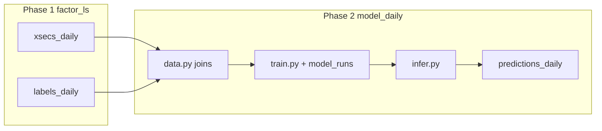

# Phase 2 (Strategies): Model training, registry, and daily inference

**Scope:** This document is the **strategy / modeling** Phase 2 aligned with [TRADING_MODULE_BLUEPRINT.md](TRADING_MODULE_BLUEPRINT.md) (“Phase 2: model training/inference plus run metadata”). It builds on **Phase 1** ([PHASE1_DETAILED_PLAN.md](PHASE1_DETAILED_PLAN.md)) and the production package **`strategies/modules/factor_ls`**.

**Not in scope here:** OMS, PMS, Redis order flows, or execution—that is covered by the separate repo doc [../PHASE2_DETAILED_PLAN.md](../PHASE2_DETAILED_PLAN.md) (OMS / broker integration). Keep naming distinct: **“Strategies Phase 2”** = this file; **“OMS Phase 2”** = `docs/PHASE2_DETAILED_PLAN.md`.

---

## 1. Goal

Deliver a **repeatable training and daily inference** path that:

- Reads **canonical features and labels** from Postgres `strategies_daily` (Phase 1 tables).
- Persists **`model_runs`** metadata (hyperparameters, metrics, artifact pointer, train window).
- Persists **`predictions_daily`** per `(bar_ts, symbol)` (predicted target / score and optional diagnostics).
- Stays **strictly no-lookahead**: training windows end before inference `bar_ts`; inference uses only rows available at that day key.

Out of scope for Phase 2 (defer to Phase 3 in the blueprint): **`target_weights_daily`**, **`order_intents_daily`**, portfolio optimizers, execution-policy buffers, Risk/OMS publishing.

---

## 2. Prerequisites (Phase 1 reality)

| Item | Status / contract |
|------|-------------------|
| **Tables** | `strategies_daily.l1feats_daily`, `signals_daily` (optional), `factors_daily`, `xsecs_daily`, `labels_daily` exist (Alembic revision `h3i4j5k6l7m8` + successors). |
| **Keys** | Primary key `(bar_ts, symbol)`; `bar_ts` = UTC midnight trading-day key. |
| **Feature matrix `X`** | Default production contract: **13** columns in `xsecs_daily` (`*_rank`), joined on `(bar_ts, symbol)`. |
| **Labels `y`** | `labels_daily`: wide columns per Phase 1 (e.g. `logret_fwd_<h>`, `normret_fwd_<h>`, `vol_weight_<h>`, `vol_weighted_return_<h>` for configured horizons; primary modeling target may remain `vol_weighted_return_1` to match research). |
| **Universe** | Phase 1 loads **all symbols** present in `market_data.ohlcv` for the extract window—no env symbol list. Phase 2 training/inference must define **eligibility** (e.g. min history, min cross-section size per `bar_ts`) in code or config constants, not ad-hoc env lists. |
| **Schedule context** | Phase 1 doc: production **00:00 UTC** cadence; **24** completed daily `bar_ts` per batch; intraday default **1h** so each calendar day uses opens `00:00…23:00` UTC for aggregation. Inference should align to the same `bar_ts` grid. |
| **Pipeline lineage** | Reuse `pipeline_version` / `source` patterns from Phase 1 for any new writers. |

---

## 3. Schema additions (`strategies_daily`)

Align with [TRADING_MODULE_BLUEPRINT.md](TRADING_MODULE_BLUEPRINT.md) § “Data model to add”. Exact columns can be refined in Alembic; minimum contract:

### 3.1 `model_runs`

| Column | Type | Notes |
|--------|------|--------|
| `id` | `bigserial` PK | |
| `run_kind` | `text` not null | e.g. `train`, `eval`, `backfill_score` |
| `strategy_id` | `text` not null | stable id (e.g. `double_sort_xgb_v1`) |
| `train_bar_ts_start` | `timestamptz` | inclusive (UTC midnight) |
| `train_bar_ts_end` | `timestamptz` | inclusive; **strictly &lt; first inference bar_ts** for that deploy |
| `feature_manifest` | `jsonb` | list of `xsecs_daily` column names + optional `labels_daily` target columns |
| `hyperparameters` | `jsonb` | XGBoost / Optuna snapshot |
| `metrics` | `jsonb` | in-sample / validation metrics (RMSE, mean CS Spearman, decile spread, etc.) |
| `artifact_uri` | `text` | path or URI to serialized model (file, object store—implementation choice) |
| `pipeline_version` | `text` | training code + config version |
| `created_at` | `timestamptz` default `now()` | |

Indexes: `(strategy_id, created_at desc)`, `(train_bar_ts_end)`.

### 3.2 `predictions_daily`

| Column | Type | Notes |
|--------|------|--------|
| `bar_ts` | `timestamptz` not null | join key |
| `symbol` | `text` not null | |
| `model_run_id` | `bigint` not null FK → `model_runs.id` | |
| `prediction` | `double precision` | primary score (e.g. raw regressor output) |
| `prediction_rank` | `double precision` null | optional `groupby(bar_ts).rank(pct=True)` for parity with research |
| `target_name` | `text` | e.g. `vol_weighted_return_1` for traceability |
| optional diagnostics | … | residual, quantile bin, etc. |
| `created_at` / `updated_at` / `pipeline_version` / `source` | same pattern as Phase 1 | |

Primary key: `(bar_ts, symbol, model_run_id)` **or** `(bar_ts, symbol)` if exactly one “active” model per strategy (product choice—prefer composite PK if multiple runs per day for audit).

Indexes: `(bar_ts)`, `(symbol, bar_ts)`, `(model_run_id)`.

---

## 4. Module layout (recommended)

New package parallel to `factor_ls`:

```text
strategies/modules/model_daily/
  __init__.py          # e.g. run_train, run_infer
  config.py            # strategy_id, target column, horizons, paths, device
  data.py              # SQL/pandas loaders: xsecs + labels joins on (bar_ts, symbol)
  splits.py            # walk-forward: train end < infer bar_ts
  train.py             # wrap Optuna + XGBoost (port patterns from strategies/research/opt_xgb.py)
  infer.py             # batch predict for one or many bar_ts; rank optional
  persistence.py       # insert model_runs; upsert predictions_daily
  validators.py        # required columns, schema contracts
```

Research scripts **`strategies/research/opt_xgb.py`** and **`double_sort.ipynb`** remain the R&D surface; **`model_daily`** owns **production** training/inference, reading from Postgres instead of `create_data.load_data()` parquet paths.

---

## 5. Data flow



- **Train:** `SELECT … FROM strategies_daily.xsecs_daily x JOIN strategies_daily.labels_daily y USING (bar_ts, symbol) WHERE bar_ts BETWEEN :start AND :end` (+ filters). Persist **`model_runs`** row then write artifact.
- **Infer:** For each target `bar_ts` batch (e.g. latest completed day or backfill range), load features for that day across symbols, load model artifact from latest **`model_runs`** for `strategy_id`, write **`predictions_daily`** with `model_run_id` FK.

---

## 6. Training and inference policy

(Recommended defaults from the blueprint; tune in `config.py`.)

| Policy | Default |
|--------|---------|
| **Retrain cadence** | **Weekly** full retrain on a rolling window ending at last available `bar_ts` before the week boundary; **daily** job only runs **inference** + writes predictions. |
| **Emergency retrain** | Optional hook: if rolling validation metric breaches threshold, enqueue `run_train` (out of band). |
| **Walk-forward** | Train window never includes inference `bar_ts`; purge/embargo optional for overlapping feature windows if you later add non-daily features. |
| **Metrics** | Align with research: RMSE, mean cross-sectional Spearman(pred, target), decile spread / Sharpe-style objectives as in `opt_xgb.py`. |

---

## 7. Tasks (checklist)

- [ ] **Alembic:** `model_runs`, `predictions_daily` (+ indexes, FK, downgrade).
- [ ] **`model_daily/config.py`:** `strategy_id`, target column (`vol_weighted_return_1` or configurable), `DATABASE_URL` / `STRATEGIES_PIPELINE_DATABASE_URL`, artifact root path or bucket (macro env only—see `.cursor/rules/env-and-config.mdc`).
- [ ] **`model_daily/data.py`:** Loaders with parameterized `bar_ts` ranges; optional symbol filter for dev.
- [ ] **`model_daily/splits.py`:** Walk-forward split helpers; assert no future rows in train for a given infer date.
- [ ] **`model_daily/train.py`:** Port objective from `opt_xgb.py` (or call shared pure functions extracted to a small `strategies/core/ml/` module if you want one copy).
- [ ] **`model_daily/infer.py`:** Batch predict; optional within-day rank for downstream Phase 3.
- [ ] **`model_daily/persistence.py`:** Writers + upserts; set `pipeline_version`, `updated_at`.
- [ ] **`model_daily/validators.py`:** Column contracts for reads/writes.
- [ ] **CLI:** `scripts/run_model_daily.py` with subcommands `train` / `infer` / `backfill` (mirror `scripts/run_factor_ls.py` style).
- [ ] **Tests:** `strategies/tests/model_daily/` — unit tests on splits and metrics; integration test with fixture DB or skipif no URL; golden small frame parity with `opt_xgb` on identical inputs (optional).

---

## 8. Test plan (summary)

- **Splits:** For a fixed frame, assert max `train_bar_ts` &lt; min `infer_bar_ts`.
- **Persistence:** `model_runs` insert then `predictions_daily` upsert idempotency for same `(bar_ts, symbol, model_run_id)`.
- **Inference shape:** Row count equals cross-section size for that `bar_ts` (after eligibility filters).
- **Leakage:** Join keys and windowing tests (scores/labels only from `bar_ts` alignment).

---

## 9. Acceptance criteria

- One full **train** produces a row in **`model_runs`** and a loadable artifact referenced by `artifact_uri`.
- One full **infer** run for a single `bar_ts` fills **`predictions_daily`** for all eligible symbols without lookahead errors.
- Tests in `strategies/tests/model_daily` pass locally / CI.
- Docs cross-linked: Phase 1 → this doc → Blueprint Phase 3 (portfolio / intents).

---

## 10. Handoff to Phase 3 (blueprint)

Phase 3 consumes **`predictions_daily`** (and optionally raw **`factors_daily`** scores) to build **target portfolio weights** and **`order_intents_daily`**, then passes through execution policy, Risk, and OMS. Phase 2 must expose stable column names and a clear **active `model_run_id`** (or version pointer) for production schedulers.

---

## 11. Related paths (updated naming)

| Artifact | Path / note |
|----------|-------------|
| Phase 1 pipeline | `strategies/modules/factor_ls/` |
| Phase 1 CLI | `scripts/run_factor_ls.py` |
| Phase 1 spec | [PHASE1_DETAILED_PLAN.md](PHASE1_DETAILED_PLAN.md) |
| Research | `strategies/research/opt_xgb.py`, `strategies/research/double_sort.ipynb` |
| OMS “Phase 2” doc (different) | [../PHASE2_DETAILED_PLAN.md](../PHASE2_DETAILED_PLAN.md) |
