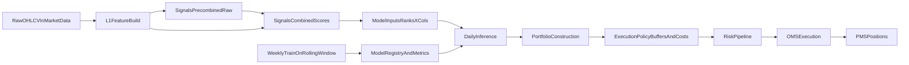

# Daily Trading Module Blueprint

## Recommendation Decisions

- Persist level-1 variables, optional raw per-family pre-score internals, combined scalar scores, cross-sectional rank factors, model predictions, and target weights/order intents.
- Use weekly retraining with daily inference as default, plus an optional emergency retrain trigger.
- Keep execution buffers and turnover controls in a separate execution-policy layer (not inside factor/model code).

## Why this persistence scope

- Level-1 variables (returns/volatility) are reusable across many models and reduce repeated compute.
- Raw per-family pre-score columns (optional) plus combined scores and cross-sectional factors improve auditability/debugging and explainability of portfolio changes.
- Predictions and weights/intents are required for post-trade attribution and model drift monitoring.
- If storage grows too fast, apply retention tiers instead of removing observability.

## Module architecture (reuse-first)

- Data ingest/read: reuse `market_data`.
- Strategy compute: build a self-contained production pipeline under `strategies/modules` and port only needed logic from the notebook.
- Risk/OMS integration: publish order intents into existing risk/OMS flow in `risk` and `oms`.
- Position baseline and reconciliation: reuse `pms`.
- Scheduling: register jobs in `scheduler`.

## Data model to add (`strategies_daily` schema)

All strategy “daily” feature tables are keyed by a **UTC trading-day key**:

- Use `bar_ts timestamptz` as **`<trading_date> 00:00:00+00:00` (GMT/UTC)**. This is the stable per-day join key across strategy tables (it is **not** necessarily equal to the last intraday `open_time`).
- `features_l1_daily`: `bar_ts` (UTC midnight day key), `symbol`, daily-aggregated inputs (`close` last, volumes/taker base summed), `log_return`, `ewvol_20` (EWM 20), `norm_close` (scaled `log_return` then per-symbol cumulative sum, per notebook), `vwap_250` (250-day ratio, must be computed per symbol), `log_volume`, `log_quote_volume` (no `taker_buy_quote_volume`).
- `signals_precombined_daily`: `bar_ts`, `symbol`, per-family **raw** columns *inside* each `get_*_score` **before** `combine_features` (no scalar `*_score` here; no duplication of L1; optional deep-audit table).
- `signals_combined_daily`: `bar_ts`, `symbol`, the **11** scalar `*_score` values after `combine_features` (the inputs cross-sectionally ranked into `x_cols`).
- `signals_xsection_daily`: `bar_ts`, `symbol`, the **11** `*_rank` features in `x_cols` from `double_sort.ipynb` lines 1-5 (regime bins like `mom_bin` are research-only/optional; see Phase 1 plan).
- `labels_daily`: `bar_ts`, `symbol`, one row per day/symbol, **wide** columns: `fwd_log_return_<h>` (and optional `fwd_simple_return_<h>`) per configured step `h`, plus notebook `y_cols` as suffixed fields (e.g. `vol_weight_1`, `vol_weighted_return_1`); **no** `horizon` column (Phase 1 plan).
- `model_runs`: train window, hyperparameters, artifact reference, and metrics.
- `predictions_daily`: per `(symbol, bar_ts)` predicted return and score ranks.
- `target_weights_daily`: `bar_ts`, per-symbol target gross/net/risk-scaled weights and policy version.
- `order_intents_daily`: `bar_ts`, desired per-symbol delta vs current holdings before risk checks.

## Daily/weekly pipeline

## Training policy recommendation

- Default: weekly retrain (rolling window ending at T-1), daily inference.
- Add trigger retrain if drift/performance thresholds breach.
- Daily retrain is not always superior; it can overfit noise and increase parameter instability.
- Weekly cadence usually improves stability/turnover while staying adaptive for daily rebalance horizons.

## Portfolio vs execution boundary

- Portfolio layer outputs ideal target weights from alpha, risk scaling, and exposure constraints.
- Execution-policy layer applies turnover penalties, no-trade bands, entry/exit buffers, and minimum order sizes.
- Keep this separation so portfolio optimizers can evolve (for example, MVO) without rewriting execution logic.

## Test plan

- Unit tests in `strategies/tests`:
  - feature determinism (same input yields same outputs)
  - no look-ahead checks for labels/features
  - cross-sectional normalization invariants
  - portfolio constraints (gross/net/risk limits)
  - execution no-trade-band and turnover math
- Integration tests:
  - end-to-end daily run from market_data snapshot to order intents
  - strategy to risk to oms contract validation (schema and required fields)
- Backtest validations:
  - walk-forward split only (no leakage)
  - compare daily vs weekly retrain on SR/turnover/drawdown
  - transaction-cost sensitivity grid

## Delivery phases

- Phase 1: deterministic factor and label pipeline plus persistence.
- Phase 2: model training/inference plus run metadata.
- Phase 3: portfolio construction plus execution-policy and order-intent publishing.
- Phase 4: scheduler jobs plus monitoring dashboards and drift alerts.

Detailed phase docs:

- Phase 1: `docs/strategies/PHASE1_DETAILED_PLAN.md`

## Section planning queue

Use this order for detailed section plans:

1. Data schema and retention policy.
2. Feature and label pipeline specification.
3. Training/inference workflow and model registry metadata.
4. Portfolio construction policies.
5. Execution-policy buffers and order intent generation.
6. Risk/OMS integration contract and failure handling.
7. Scheduler orchestration and observability.
8. Testing and acceptance criteria.
